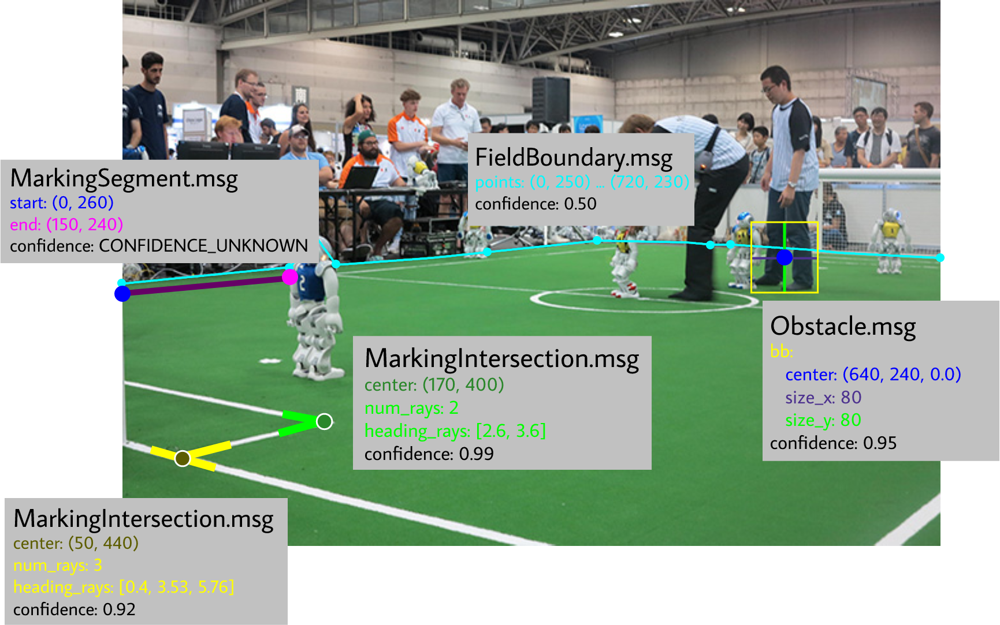
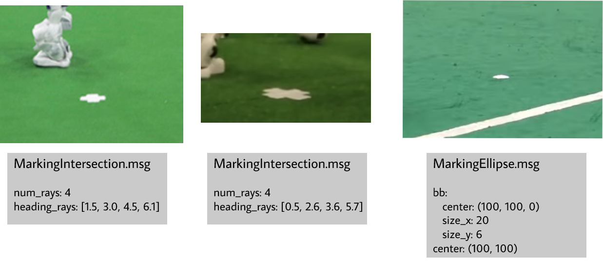

Soccer Vision 2D Msgs
#####################

This package provides 2d messages for visually detected objects on a soccer field, such as balls, field markings and robots.

Messages (.msg)
***************

* Ball
* BallArray
* FieldBoundary
* Goalpost
* GoalpostArray
* MarkingEllipse
* MarkingIntersection
* MarkingSegment
* MarkingArray
* Obstacle
* ObstacleArray
* Robot
* RobotArray

Examples
********

.. image:: images/soccer_vision_2d_msgs_visualized.png
  :align: center

